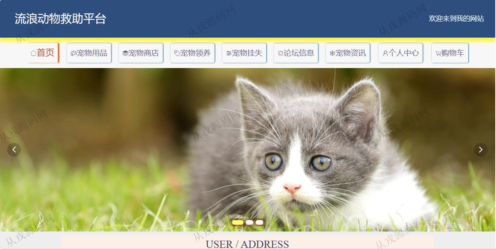
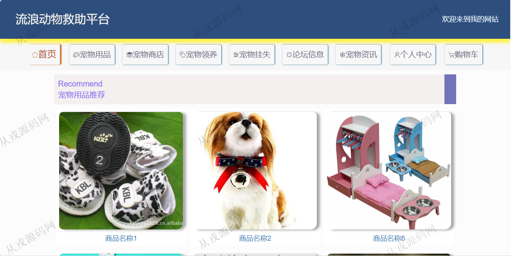
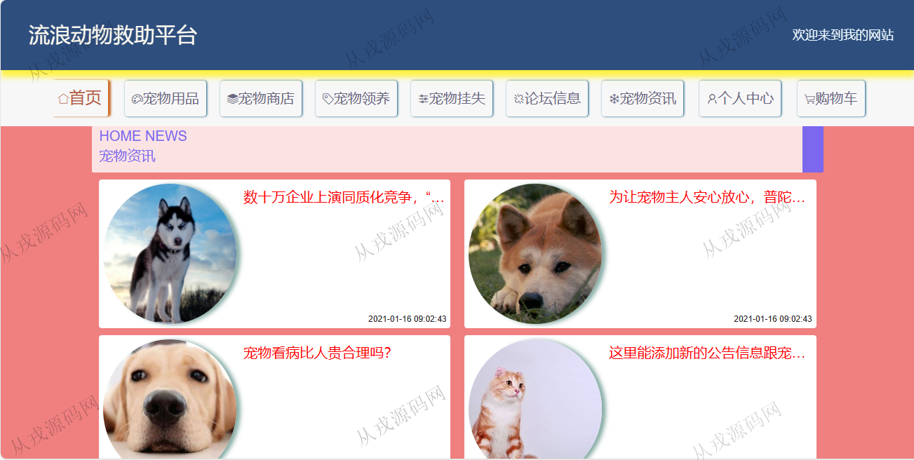
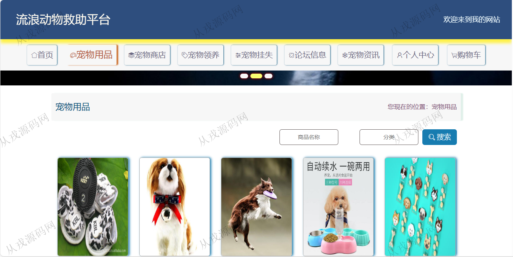
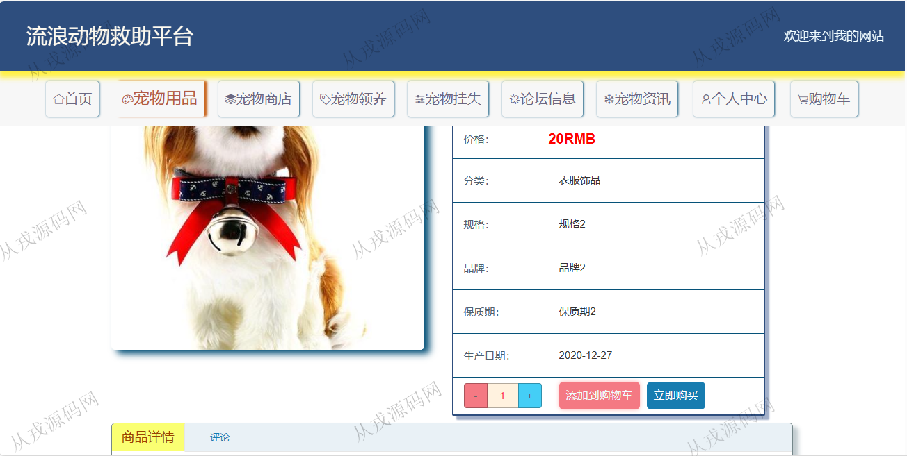
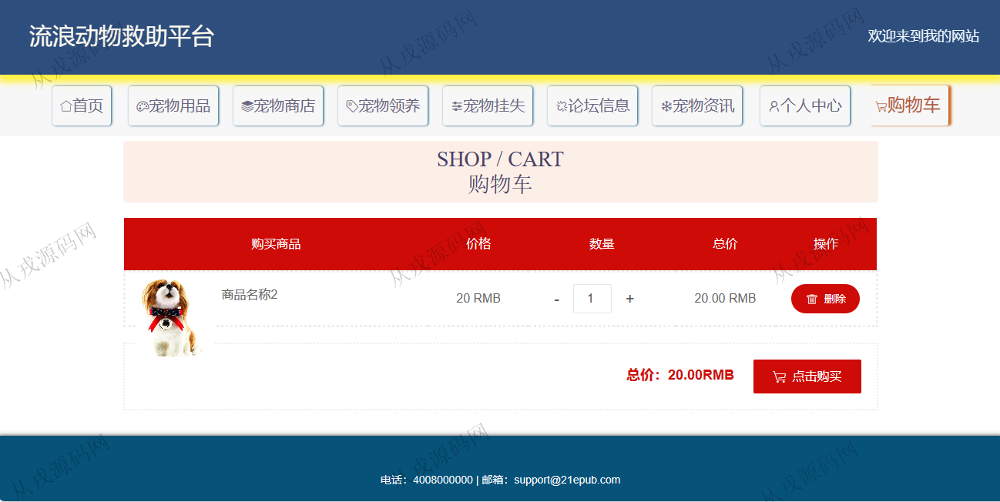
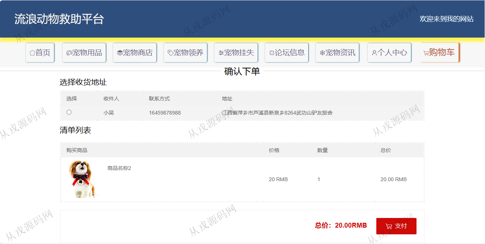
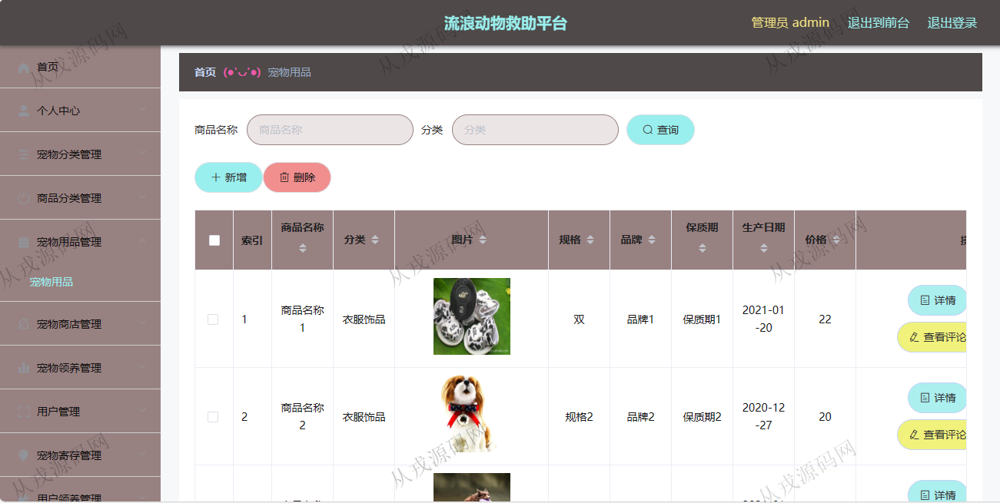

<h1 align="center">141.流浪动物救助平台管理系统</h1>

 获取sql文件 QQ: 386869957 QQ群: 377586148 

 [更多源码项目: 从戎源码网](https://armycodes.com/) 

## 简介

> 本代码来源于网络,仅供学习参考使用!
>
> 提供1.远程部署/2.修改代码/3.设计文档指导/4.框架代码讲解等服务
>
> 用户端访问地址：http://localhost:8080/ssmqj7b0/front/index.html
> 
> 用户：user 123456
>
> 管理后台访问地址：http://localhost:8080/ssmqj7b0/admin/dist/index.html#/index
>
> 管理员 : admin 123456

## 项目介绍
基于ssm+vue的流浪动物救助平台管理系统：前端 vue、elementui，后端 maven、springmvc、spring、mybatis；角色分为管理员、用户；集成宠物领养、宠物挂失、宠物用品等功能于一体的系统。

## 功能介绍

### 用户

- 基本功能：登录、注册、退出
- 网站首页：主导航栏，轮播图，宠物用品推荐，宠物资讯，宠物领养展示
- 宠物用品：用品列表展示，用品详情，购物车，结算，支付
- 宠物商店：商店列表展示，商店详情，宠物寄存
- 宠物领养：宠物列表，宠物详情，申请领养，填写领养信息
- 宠物挂失：添加宠物挂失信息，挂失宠物列表搜索查询
- 宠物论坛：帖子浏览，帖子发布，帖子详情和评论
- 宠物资讯：资讯信息展示，资讯详情
- 个人中心：个人信息查看与修改，我的发布的论坛帖子查看，我的订单信息，我的地址，我的收藏

### 管理员

- 宠物分类管理：分类信息的增删改查
- 商品分类管理：宠物用品的分类信息的增删改查
- 宠物用品：用品信息的增删改查，图片上传，商品信息支持富文本编辑
- 宠物商店：商店信息的增删改查
- 宠物领养：用户在前台浏览流浪宠物，选择合适的宠物在线登记领养，管理员后台查看领养记录，查看评论
- 用户管理：用户在前台自行注册的用户信息，管理员查看与修改，删除
- 宠物寄存：用户在商店申请寄存宠物，管理员后台查看记录，审核
- 订单管理：用户在前台购买的宠物用品，管理员查看用户下单数据，后台进行发货货退款操作

## 环境

- <b>IntelliJ IDEA 2021.3</b>

- <b>Mysql 5.7.26</b>

- <b>Node 14.14.0</b>

- <b>JDK 1.8</b>

## 运行截图

